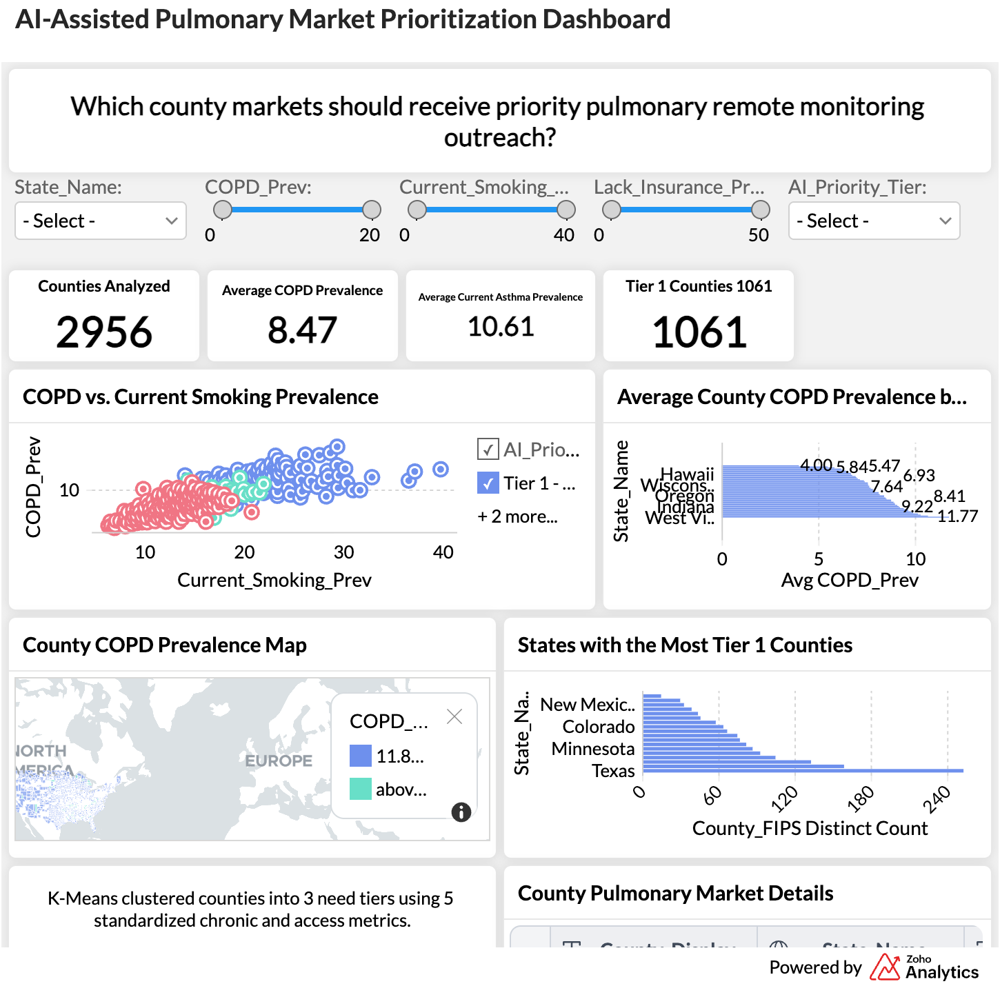

# K-Means–Based Pulmonary Market Prioritization Dashboard
[View Project Website](https://jaydeepkumar-ai.github.io/cdc-places-county-health-segmentation/)

[Open Interactive Dashboard](https://analytics.zoho.com/open-view/3253713000000010211)
An interactive healthcare analytics project using CDC PLACES 2025 data to group U.S. counties into three pulmonary-health priority tiers.

## Project Overview

This project analyzes county-level pulmonary health and healthcare-access indicators from the CDC PLACES 2025 dataset. K-means clustering was used to group counties with similar profiles into three priority tiers. The results were presented through an interactive Zoho Analytics dashboard to support geographic market prioritization.

## Business Question

Which counties should be prioritized for pulmonary remote monitoring outreach based on chronic respiratory burden, behavioral risk, and healthcare-access indicators?

## Selected Indicators

- COPD prevalence
- Current asthma prevalence
- Current smoking prevalence
- Lack of health insurance
- Physical inactivity

## Tools Used

- Python
- K-means clustering
- CDC PLACES 2025
- Zoho Analytics
- Data cleaning and standardization
- Geographic and business analysis
